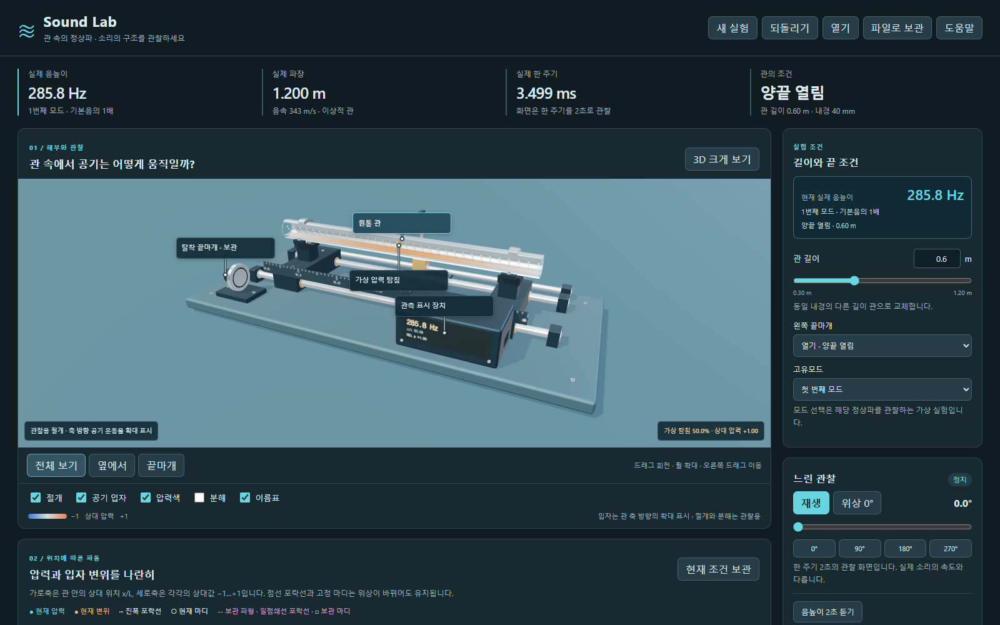

# Sound Lab

관 속 공기의 축방향 왕복 운동과 압력의 정상파를 관찰하는 한국어 교육용 실험 앱입니다. 길이·끝마개·고유모드를 바꾸고, 구조를 해부하듯 살펴보며 수치와 파형을 비교합니다.

[Windows 설치 파일](https://github.com/Ulsancl/sound-lab/releases/latest)과 [설치·업데이트 안내](docs/desktop.md)를 확인하세요. 버전별 실제 검증·배포 상태는 릴리스 기록을 따릅니다.



양끝 열림과 왼쪽 막힘/오른쪽 열림, 길이 0.30–1.20 m, 첫 세 고유모드를 다룹니다. 끝마개·고정 링·지지대·가상 탐침을 살펴보며 압력 마디와 변위 마디가 다른 위치에 있는 이유를 비교합니다. 공기 표시는 관의 축 방향으로만 움직이며 표시 진폭은 실제 이동거리 측정값이 아닙니다.

화면의 느린 관찰은 한 주기 2초입니다. 실제 주파수·주기는 별도로 표시하며 조건 조작 옆에서도 현재 Hz와 고조파 배수를 읽을 수 있습니다. 명시적으로 선택하는 2초 음높이 예시는 해당 주파수의 순음입니다. 디지털 gain은 실제 스피커의 음압·dB를 뜻하지 않으며, 악기의 음색을 재현하지 않습니다. 오디오를 사용할 수 없어도 수치·화면 실험은 계속 사용할 수 있습니다.

1.1.0에서는 같은 탐침의 압력·속도 궤적, 순간값·진폭·RMS와 관 전체의 압축·운동 에너지 비율을 함께 읽습니다. 마디 버튼은 해석 좌표로 탐침을 옮기며, 보관한 파형만 볼 때도 포락선과 마디를 유지합니다. [상세 계측의 기준](docs/detail-refinement.md)에 상대값과 실제 단위의 차이를 설명합니다.

지지대의 실제 레일 구멍, 고정 링 받침, 끝마개 씰 홈과 별도 탐침 가이드를 살펴볼 수 있습니다. `내부 구조 자세히`는 선택한 부품을 잠시 드러내며, 관찰을 마치면 이전 카메라로 돌아갑니다. 관찰 중 저장한 파일에도 원래 카메라와 현재 표시 옵션을 보관합니다.

길이와 음높이, 끝마개와 모드, 마디와 입자를 다루는 [세 안내 실험](docs/experiments.md)을 제공합니다. 실제 조건을 맞추고 관찰 확인을 눌러 진행합니다. 순간 압력이 0인 것과 늘 진폭이 0인 마디를 구분하고, 한쪽이 막힌 관의 두 번째 모드가 기본음의 3배라는 관계를 확인합니다.

파일은 관의 조건·위상·탐침·보관한 비교·관찰 시점을 기록합니다. 파형·주파수는 입력에서 다시 계산하며 재생 중 여부·오디오·안내 진행은 저장하지 않습니다. 불러오기와 재시작은 정지·무음 상태입니다. 다른 길이의 비교는 공통 `x/L` 위치축을 사용하고 실제 길이도 함께 읽어야 합니다.

## 개발 실행

Node.js 24.19.0에서 다음 명령을 사용합니다.

```powershell
npm ci
npm run dev
```

`npm test`는 모형·기하·저장·원자적 파일 교체·안내·오디오와 상세 계측 검사를 실행합니다. `npm run test:browser`는 실제 화면 조작과 오프라인 오디오 표본, `npm run test:consumer`는 조작 옆 결과 표시와 관찰 경험을 확인합니다. `npm run test:detail`은 상세값·마디 이동·내부 관찰·저장과 복귀를 확인합니다. 첫 브라우저 검사 전 `npx --no-install playwright install chromium`으로 검사 브라우저를 준비합니다.

`npm run build`는 웹 산출물, `npm run desktop`은 로컬 데스크톱 앱을 엽니다. 네이티브 검사는 `node scripts/desktop.mjs prepare-test` 후 `npm run test:desktop`을 사용합니다. 브라우저·네이티브 검사는 동시에 실행하지 않습니다.

Windows CI는 잠긴 의존성 설치 → 순수 검사 → 웹 빌드 → 브라우저 → 소비자 관찰 → 상세 관찰 → 소스 네이티브 → 패키징 → 독립 실행 파일 네이티브 순서입니다. 설치 파일 해시·고지를 확인하고 실패 자료를 보관합니다. 릴리스 게시는 자동으로 실행하지 않습니다. CI의 가상 GPU 결과와 실제 하드웨어 결과는 구분합니다.

`npm run package:desktop`은 Windows x64 설치 파일과 SHA-256을 만듭니다. 설치 앱 실행에는 Node.js나 개발 서버가 필요하지 않습니다. 개발 의존성 설치는 인터넷을 사용할 수 있습니다. 코드 서명과 자동 업데이트는 제공하지 않습니다. 대상은 Windows 11 x64이며 실제 호환성·설치·업데이트 결과는 해당 릴리스 기록을 따릅니다.

- [모형과 원리 출처](docs/model.md), [구조](docs/anatomy.md), [세 실험](docs/experiments.md)
- [저장과 복원](docs/storage.md), [Windows 앱](docs/desktop.md), [로컬 자료와 개인정보](docs/privacy.md)
- [배포 범위와 확인 기준](docs/distribution.md), [문제 보고](docs/support.md), [제3자 고지](docs/THIRD-PARTY-NOTICES.md)

고정 음속 343 m/s의 이상적인 1차원 관입니다. 끝단 보정·방사·손실·벽 진동·마이크 부하·임의 주파수 구동을 계산하지 않습니다. 실제 악기나 방음·음향 안전·제품 설계를 검증하는 도구가 아닙니다. 앱 검사를 실제 사용자 연구나 판매 검증으로 해석하지 않습니다.

자체 소스·문서·기하·아이콘은 `LICENSE.txt`의 UNLICENSED 권리 표기를 따릅니다. 공개 저장소라는 이유로 재배포·판매 권한을 부여하지 않습니다. 외부 라이브러리의 개별 라이선스는 유지하며 제조사 사진·CAD·교재 도판·외부 음원은 번들하지 않습니다.
